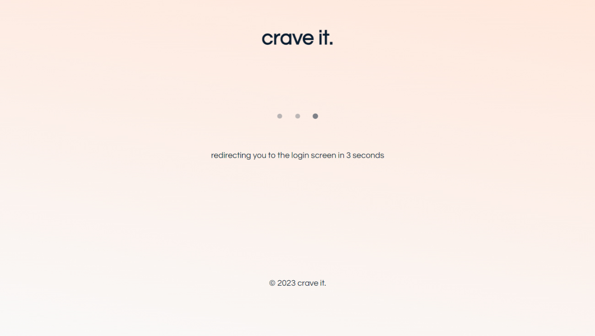
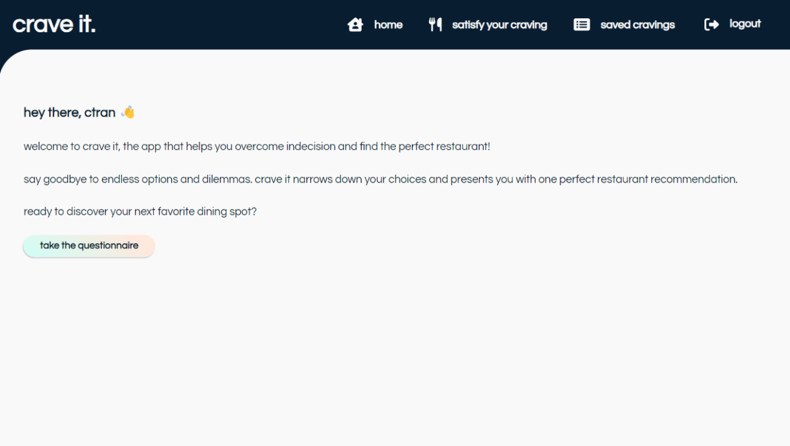
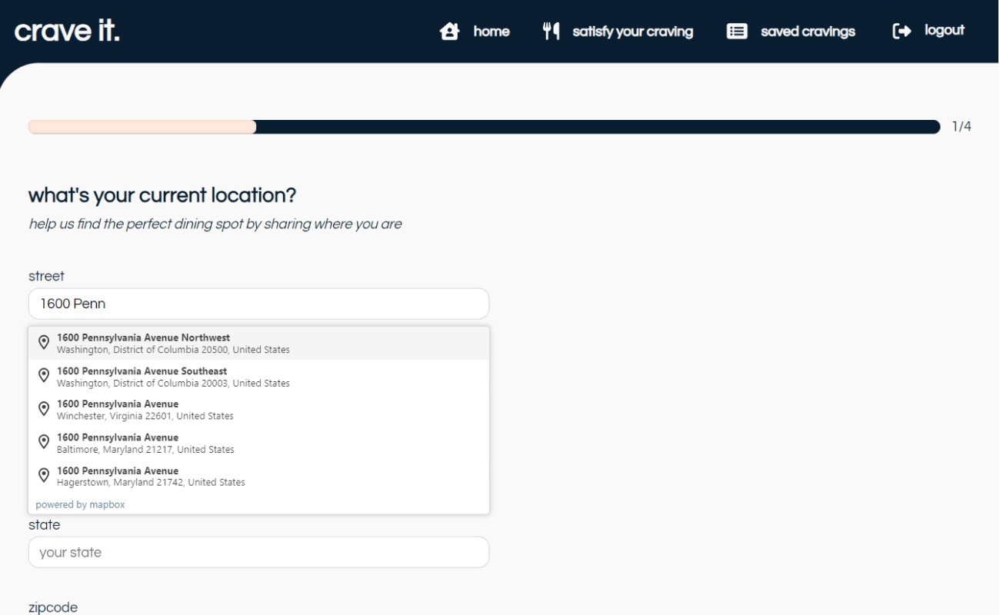
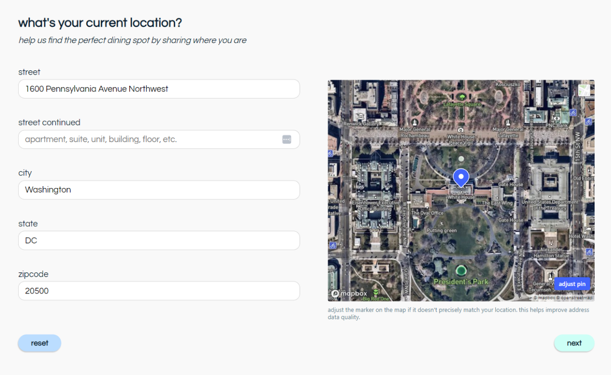
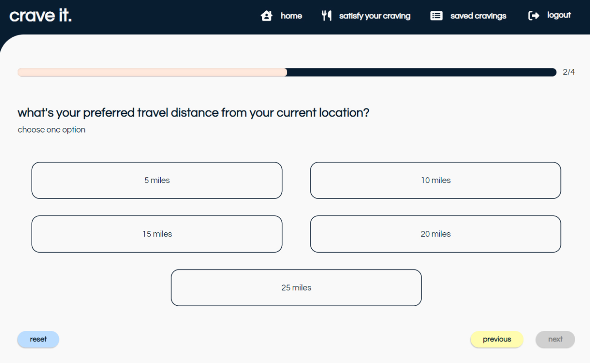
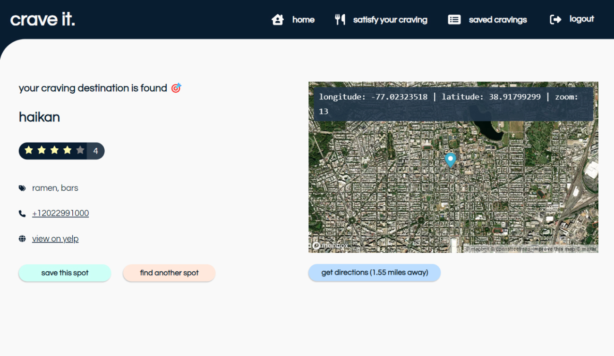
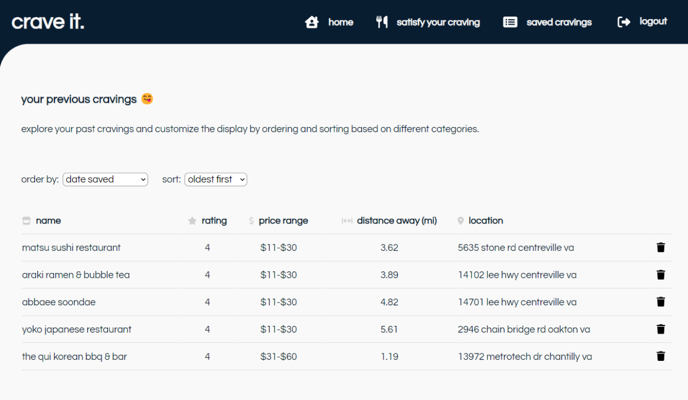
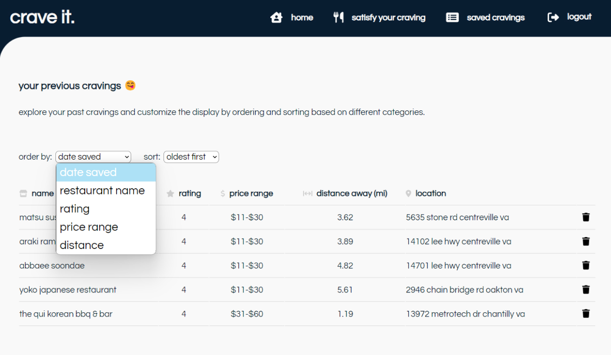
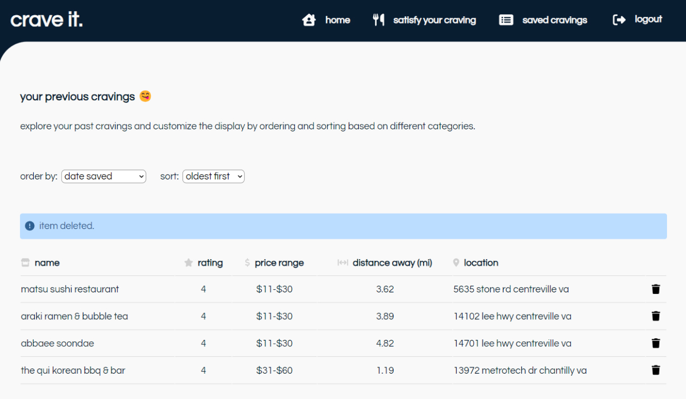

<h1 align="center">CraveIt</h1>

An application designed to alleviate indecision by presenting users with a single, tailored restaurant recommendation, simplifying the process of finding a dining spot.

 

## Features 
### User Login and Registration 

* Users are able to register for an account. If there is an issue with the provided information, an error message is shown.
* Once registered, users can log in using their username and password. If the credentials are incorrect, an error message is shown.
 

### Unauthorized Pages

* If a user tries to access a restricted page without being logged in, they are automatically redirected to the login screen.
 
  
### Home Page

* The home page displays a welcome message, description of the application, and a bold call-to-action button to take the questionnaire.

 

### Questionnaire

* The questionnaire consists of four questions, with the first one asking users about their location. As users start typing their address, an autocomplete recommendation feature is provided. 
 

* Once the address is filled out, an interactive map is displayed on the right side, showing a pin on the input address for visual confirmation.
 

* For each question, the "Next" button is disabled and greyed out until an answer is provided.
* The progress bar at the top displays the current progress status as users proceed through the questionnaire.
 

### Questionnaire Result 

* Once the quiz is submitted, a result is calculated, and a result page is displayed with a tailored restaurant recommendation. The page shows the restaurant's name, rating, phone number, and more.
* An interactive map with a pin on the restaurant's location is also provided, along with a link to Google Maps for directions. 
* Users have the option to save the current result to appear in the "Saved Cravings" page or fetch another recommendation with the same questionnaire criteria.
 

### Saved Results

* The "Saved Results" page displays all the restaurant recommendations that have been saved by the user in a table.
* The results are initially ordered from oldest to newest. 
 

* Users have the option to order the table by restaurant name, rating, price range, or distance.
* They can also choose to sort the table in ascending or descending order based on the selected "order by" option.
 

* Each result can be deleted by clicking on the trash icon, and a confirmation message is shown upon successful deletion.
 

### Responsive Design
* The application is designed to be responsive from desktop to mobile devices. CSS media queries ensure that the layout and styling adapt to different screen sizes..

 
 
 

